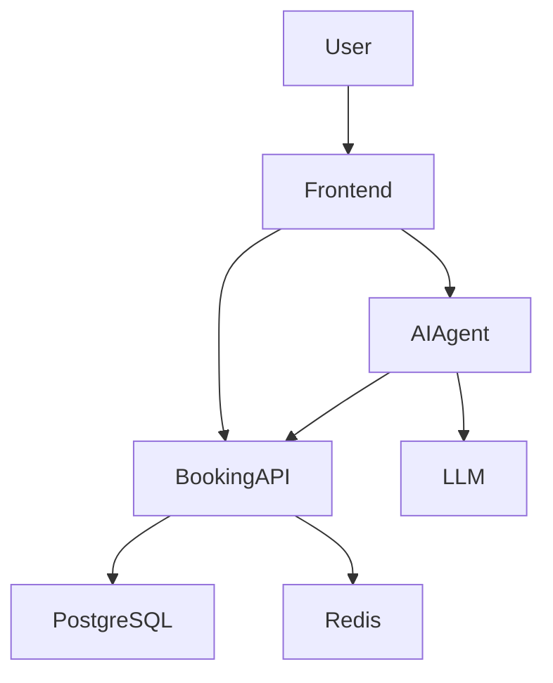

# Seatify — Architecture Design Document

**Status:** Draft
**Version:** 0.1
**Last updated:** 2026-08-28

---

## 1. Overview

### 1.1 Purpose

Seatify is an event discovery and reservation platform.

Users can discover events, inspect event details and available seats, and create and manage reservations.

The platform also provides an AI-powered assistant that allows users to interact with the system using natural language.

The project is primarily intended as a technical learning project focused on:

* backend development
* system architecture
* AI-assisted software development
* LLM integration and tool calling
* distributed systems
* containerization
* Kubernetes
* automated testing
* observability
* failure handling

The system should remain limited in functional scope while providing enough technical complexity to simulate a realistic production system.

---

## 2. Goals

The main goals of the project are:

1. Build a complete event reservation platform.
2. Develop the core backend manually.
3. Use AI-assisted development for selected parts of the application.
4. Integrate an LLM as an agent capable of interacting with the application through tools.
5. Learn Python/FastAPI through implementation of the core backend.
6. Practice designing APIs and service boundaries.
7. Containerize the application using Docker.
8. Deploy the system to Kubernetes.
9. Implement automated testing based on real user flows.
10. Test system behavior under failures and concurrent requests.
11. Introduce observability through logs, metrics and traces.

---

## 3. Non-Goals

The initial version will intentionally NOT attempt to implement:

* real payment processing
* real ticket issuing infrastructure
* real email delivery
* social networking features
* event reviews
* messaging between users
* complex recommendation systems
* multiple geographical regions
* production-grade financial infrastructure
* a large microservice architecture

These features may be considered in future iterations but are outside the scope of the initial project.

---

# 4. High-Level Architecture

The initial architecture consists of:

* React frontend
* Booking API
* AI Agent
* PostgreSQL
* Redis
* LLM provider

The system will initially be developed locally and later containerized and deployed to Kubernetes.



The architecture intentionally separates the deterministic application domain from AI-driven orchestration.

---

# 5. Components

## 5.1 Frontend

**Technology:** React + TypeScript

The frontend provides the user interface for both traditional application flows and AI-assisted interaction.

### Responsibilities

* authentication UI
* event discovery
* event search and filtering
* event details
* seat selection
* reservation management
* AI chat interface
* displaying AI-generated results
* requesting user confirmation before sensitive operations

The frontend should not contain business-critical reservation logic.

---

## 5.2 Booking API

**Technology:** Python + FastAPI

The Booking API is the core application backend.

It contains the authoritative business logic of Seatify.

### Responsibilities

* authentication and authorization
* user management
* event management
* venue management
* seat availability
* reservation creation
* reservation cancellation
* reservation validation
* concurrency control
* persistence
* business rules

### Principle

The Booking API must remain deterministic.

The API must never trust decisions made by the LLM.

For example, if the AI Agent requests:

```text
create reservation:
event = 123
seats = A12, A13
```

the Booking API must independently verify:

* user identity
* authorization
* event existence
* seat existence
* seat availability
* reservation validity

and perform the operation inside an appropriate database transaction.

---

## 5.3 AI Agent

**Technology:** TBD

The AI Agent provides a natural-language interface to Seatify.

The agent receives user messages and decides which available tools are required to satisfy the request.

Example:

```text
User:
"Find me a rock concert in Milan this weekend for three people."

        ↓

AI Agent

        ↓

search_events()

        ↓

Booking API

        ↓

Available events

        ↓

AI Agent

        ↓

Response to user
```

### Potential tools

```text
search_events()
get_event_details()
find_available_seats()
get_user_reservations()
create_reservation()
cancel_reservation()
```

The final tool set will be defined during AI architecture design.

### Critical principle

The LLM is responsible for:

* interpreting natural language
* selecting tools
* deciding the sequence of tool calls
* presenting information
* handling conversational context

The LLM is NOT responsible for:

* determining whether a seat is actually available
* enforcing authorization
* modifying the database directly
* implementing transactional guarantees
* bypassing business rules

---

# 6. AI Interaction Model

The AI assistant should behave as an agent rather than as a simple chatbot.

Example:

```text
User
 │
 ▼
AI Agent
 │
 ├── search_events()
 │
 ▼
Booking API
 │
 ▼
Results
 │
 ▼
AI Agent
 │
 ▼
User
```

For actions that modify user state, explicit confirmation should normally be required.

Example:

```text
User:
"Find three seats for Saturday."

AI:
"I found A12, A13 and A14.
Would you like me to reserve them?"

User:
"Yes."

AI
 │
 ▼
create_reservation()
 │
 ▼
Booking API
 │
 ▼
Transaction
 │
 ▼
Reservation created
```

This prevents the LLM from autonomously performing potentially unwanted actions.

---

# 7. Service Communication

The initial communication model is HTTP/REST.

```text
Frontend → Booking API
Frontend → AI Agent
AI Agent → Booking API
```

The AI Agent should interact with the Booking API through well-defined API contracts rather than directly accessing the database.

```text
AI Agent
    │
    │ HTTP
    ▼
Booking API
    │
    ▼
PostgreSQL
```

This preserves the Booking API as the authoritative owner of the application domain.

---

# 8. Data Storage

## 8.1 PostgreSQL

PostgreSQL will be the primary persistent database.

Initial entities are expected to include:

```text
User
Event
Venue
Seat
Reservation
ReservationSeat
```

The exact schema will be defined separately in the data model document.

---

## 8.2 Redis

Redis may be introduced for:

* caching
* temporary data
* rate limiting
* session-related functionality
* distributed coordination where appropriate

Redis should not become the authoritative source of reservation data.

PostgreSQL remains the source of truth.

---

# 9. Reservation Model

Reservations are the most important business operation in Seatify.

The system must prevent two users from successfully reserving the same seat.

Example:

```text
Available seat:
A12

User A ─────┐
            ├── reservation request
User B ─────┘
```

Expected result:

```text
User A → SUCCESS
User B → CONFLICT
```

The system must never produce:

```text
User A → SUCCESS
User B → SUCCESS
```

when only one reservation is possible.

This requirement will drive decisions concerning:

* database constraints
* transactions
* isolation
* locking
* idempotency
* concurrency testing

---

# 10. Application States

Reservations should have explicit states.

Initial proposal:

```text
PENDING
CONFIRMED
CANCELLED
```

The exact lifecycle will be defined during domain modeling.

If payment is not implemented, `PENDING` may be unnecessary in the initial MVP.

---

# 11. Docker

Each independently deployable application will have its own container image.

Initial containers:

```text
frontend
booking-api
ai-agent
postgres
redis
```

Docker Compose will be used initially for local multi-container development.

Example:

```text
docker compose
    │
    ├── frontend
    ├── booking-api
    ├── ai-agent
    ├── postgres
    └── redis
```

---

# 12. Kubernetes

After the application works locally, the system will be deployed to Kubernetes.

Initial Kubernetes components:

```text
Namespace
│
├── frontend
├── booking-api
├── ai-agent
├── postgres
└── redis
```

Potential Kubernetes resources:

* Deployments
* Services
* ConfigMaps
* Secrets
* PersistentVolumes / PersistentVolumeClaims
* Ingress
* Readiness probes
* Liveness probes
* Resource requests and limits
* Horizontal Pod Autoscaler

The Kubernetes architecture will evolve as the application gains requirements.

---

# 13. Testing Strategy

Testing will focus on both individual components and complete user flows.

## 13.1 Unit Tests

Test isolated business logic.

Examples:

* reservation validation
* seat selection
* authorization rules
* event filtering

---

## 13.2 Integration Tests

Test communication with real dependencies or realistic test environments.

Examples:

```text
Booking API → PostgreSQL
Booking API → Redis
AI Agent → Booking API
```

---

## 13.3 End-to-End Tests

Tests should reproduce real user behavior.

Example:

```text
Register
 ↓
Login
 ↓
Search event
 ↓
Open event
 ↓
Select seats
 ↓
Create reservation
 ↓
Verify reservation
```

---

## 13.4 AI Agent Evaluation

The AI Agent should also have dedicated evaluation scenarios.

Example:

```text
Input:
"I want a rock concert in Milan this weekend for four people."

Expected behavior:

1. Search events
2. Filter relevant results
3. Find available seats
4. Present options
5. Ask for confirmation before booking
```

Evaluation should consider:

* tool selection
* tool parameters
* tool call sequence
* final response
* hallucinations
* unauthorized actions
* unnecessary tool calls

---

# 14. Failure Testing

The system should deliberately be tested under failure conditions.

Examples:

### Booking API unavailable

```text
AI Agent
    ↓
Booking API
    X
```

The AI Agent should handle the failure gracefully.

---

### AI Agent unavailable

The traditional Seatify interface should remain usable.

```text
AI Agent ❌

Frontend → Booking API → works
```

This demonstrates that the AI functionality is an additional capability rather than a dependency of the core booking system.

---

### Database unavailable

The Booking API should return an appropriate error without corrupting reservation state.

---

### Pod failure

Delete an active Kubernetes pod:

```text
kubectl delete pod ...
```

Kubernetes should recreate the pod and restore service availability.

---

### Concurrent reservations

Multiple users should attempt to reserve the same seat simultaneously.

Expected behavior:

```text
N requests
     ↓
1 successful reservation
N-1 rejected requests
```

---

# 15. Observability

Observability will be introduced after the core system is functional.

The system should eventually provide:

### Logs

Structured application logs containing information such as:

```text
request_id
user_id
event_id
reservation_id
service
timestamp
```

### Metrics

Potential metrics:

```text
HTTP request count
HTTP error rate
request latency
reservation success rate
reservation conflicts
AI tool calls
AI request latency
queue size
```

### Tracing

Distributed tracing may eventually follow a request such as:

```text
Frontend
 ↓
AI Agent
 ↓
Booking API
 ↓
PostgreSQL
```

This will allow individual user actions to be followed across services.

---

# 16. Security Principles

The system should follow basic security principles from the beginning.

* Authentication handled by the backend.
* Authorization enforced by the Booking API.
* Secrets stored outside source code.
* LLM never accesses the database directly.
* LLM cannot bypass business rules.
* Input validation performed server-side.
* Sensitive operations require explicit confirmation where appropriate.
* API endpoints must not trust data supplied by the frontend or AI Agent.

---

# 17. Development Strategy

Development will proceed incrementally.

## Phase 1 — Foundation

* repository setup
* monorepo structure
* documentation
* development environment
* frontend skeleton
* Booking API skeleton

## Phase 2 — Core Domain

* users
* events
* venues
* seats
* reservations
* database
* authentication

## Phase 3 — Frontend

* event discovery
* event details
* seat selection
* reservation flow
* reservation history

Claude Code may be used extensively for frontend implementation and development assistance.

## Phase 4 — AI Agent

* define AI use cases
* define tools
* integrate LLM
* implement agent loop
* implement conversation handling
* implement confirmation mechanism
* implement AI evaluation

## Phase 5 — Containerization

* Dockerfiles
* Docker Compose
* production-like local environment

## Phase 6 — Kubernetes

* deployments
* services
* configuration
* secrets
* storage
* ingress
* health checks
* scaling

## Phase 7 — Reliability & Testing

* integration tests
* E2E tests
* concurrency tests
* failure testing
* load testing

## Phase 8 — Observability

* structured logging
* metrics
* tracing
* dashboards

---

# 18. Architectural Principles

The project should follow these principles:

### 18.1 Keep the domain deterministic

Reservation correctness must never depend on LLM behavior.

### 18.2 AI should augment the application

The AI Agent provides an alternative interface to existing capabilities rather than replacing the core application.

### 18.3 Services communicate through contracts

The AI Agent should consume Booking API capabilities through explicit interfaces.

### 18.4 Prefer simplicity

New infrastructure should only be introduced when there is a concrete requirement for it.

### 18.5 Avoid premature microservices

The system should start with a small number of clearly defined components.

### 18.6 Design for failure

Failures should be expected and tested rather than treated as exceptional theoretical cases.

### 18.7 Test behavior, not only implementation

The primary validation mechanism should include realistic user flows in addition to unit and integration tests.

---

# 19. Open Architectural Questions

The following decisions remain intentionally open:

* [ ] Authentication mechanism
* [ ] Exact LLM provider/model
* [ ] AI Agent framework vs direct SDK implementation
* [ ] Whether Redis is required in the MVP
* [ ] Whether asynchronous processing/queueing is required
* [ ] Exact reservation state machine
* [ ] PostgreSQL deployment strategy in Kubernetes
* [ ] Kubernetes local environment (kind/minikube/etc.)
* [ ] CI/CD architecture
* [ ] Observability stack
* [ ] Exact API versioning strategy

These decisions should be made when their corresponding requirements become clearer rather than being decided prematurely.

---

# 20. Current Target Architecture

The initial target architecture is therefore:


The core principle is:

```text
                    ┌──────────────┐
                    │     LLM      │
                    └──────┬───────┘
                           │
                           ▼
                    ┌──────────────┐
                    │   AI Agent   │
                    └──────┬───────┘
                           │
                     Tool calls
                           │
                           ▼
                    ┌──────────────┐
                    │ Booking API  │
                    │              │
                    │ Source of    │
                    │ truth        │
                    └──────┬───────┘
                           │
                           ▼
                       PostgreSQL
```

The AI layer interprets user intent and orchestrates actions.

The Booking API enforces business rules and guarantees data correctness.

The database remains the authoritative source of persistent state.
